# Explicação do Jogo canvas

Feito por Cauã Silva👦 e Juliana👩

2°Jogos Digitais🕹️

O jogador(personagem) deve completar o jogo desviando de obstáculos que vão surgindo na tela. Se ele colidir com algum obstáculo, ele irá ficar parado e o tubarão chegará cada vez mais próximo, se  o tubarão chegar no personagem, derrota, mas se o jogador conseguir fugir, vitória.

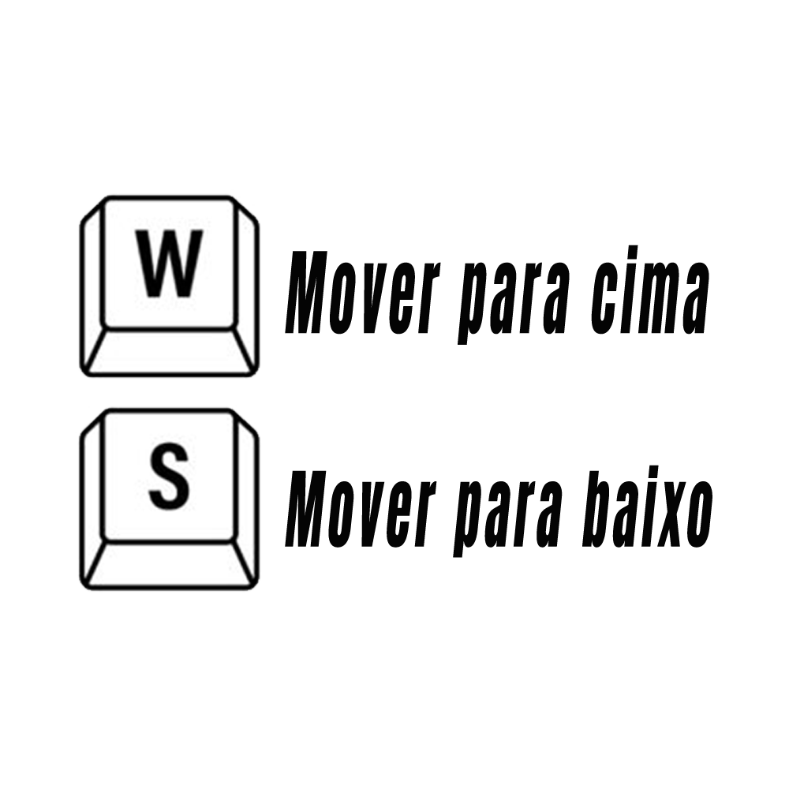

## HTML
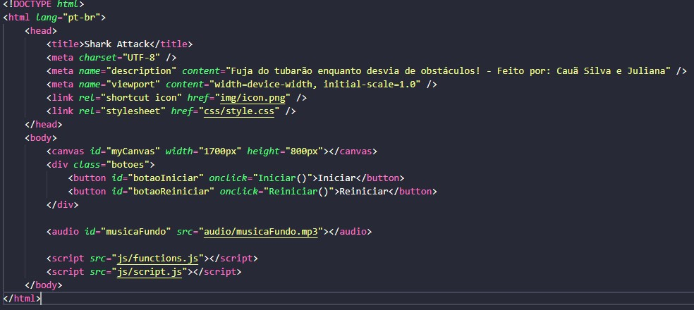

Foi feita a estrutura básica do HTML, e dentro do body foi adicionado o canvas com o id "myCanvas", uma div com a classe "botoes", onde dentro dela possui dois botões que farão parte do nosso jogo, o botão de iniciar e o de reiniciar. No fim adicionamos um audio, que será a música de fundo do nosso jogo e chamamos os javascripts, um possuindo as funções do jogo e outro com os scripts.

## CSS
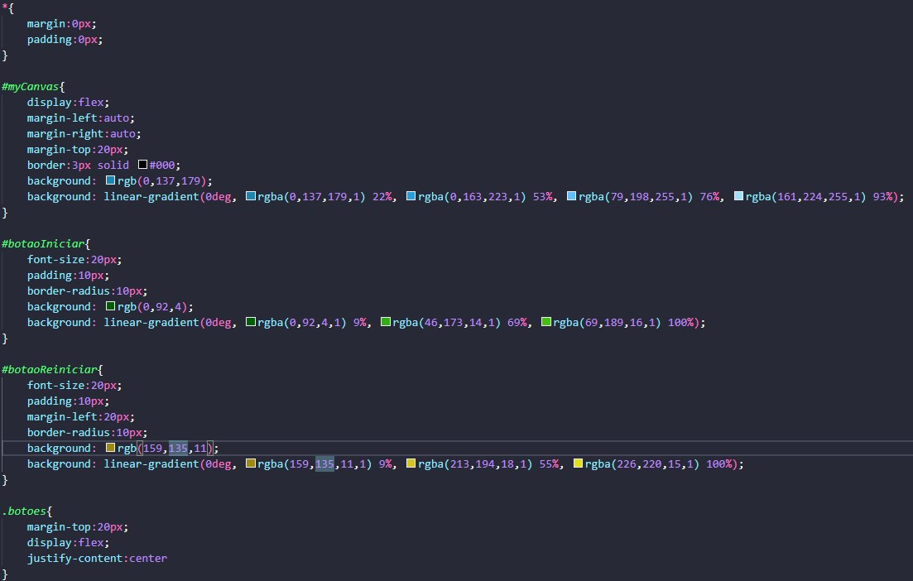

No css adicionamos uma cor de fundo gradiante no canvas e o alinhamos. Também personalizamos todos os botões e os alinhamos.

## JAVASCRIPT FUNCTIONS
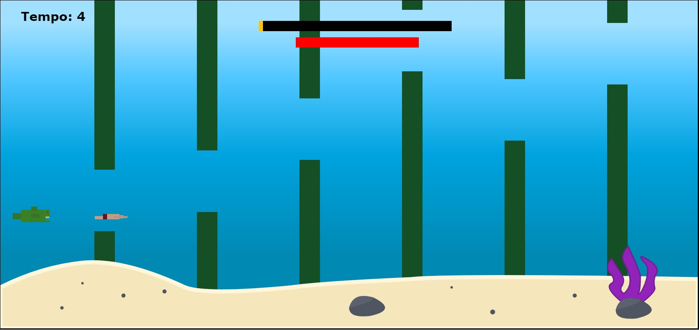

No function.js colocamos tudo que foi utilizado para fazer o cenário, personagens e os obstáculos, além da barra do percurso e a barra de vida.

A areia, pedras e algas foram feitas utilizando linhas, curvas (todas do tipo quadraticCurveTo) e círculos.

### Obstáculos
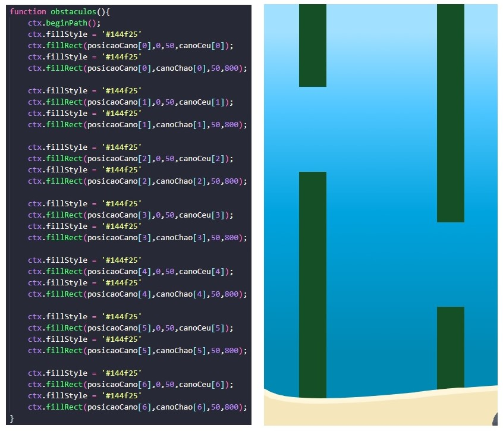

Foram criados 6 obstáculos, todos verdes e feitos com um retângulo. Os nomes das variáveis posicaoCano, canoChao e canoCeu serão explicadas.

### Personagem e tubarão
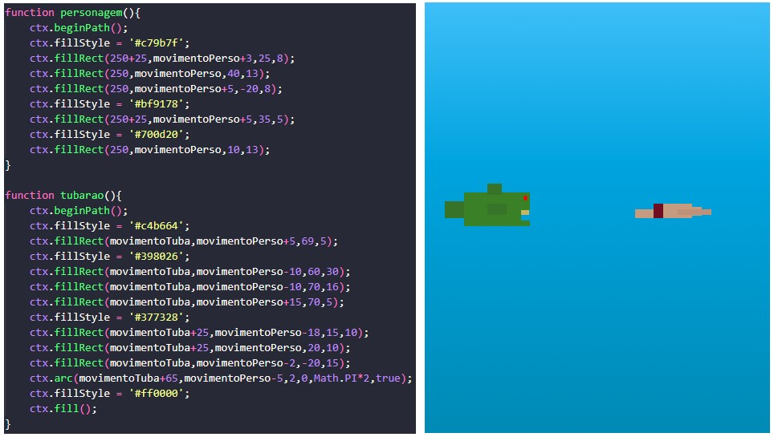

O personagem e o tubarão foram feitos utilizando retângulos e um círculo para o olho do tubarão. Os nomes das variáveis movimentoPerso e movimentoTuba serão explicadas.

### Barra de vida e barra do percurso
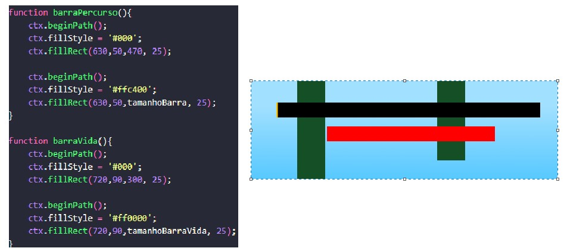

Por fim as barras, que foram feitas com retângulos um por cima do outro, onde o de baixo é preto para mostrar que está vazia. As variáveis tamanhoBarra e tamanhoBarraVida serão explicadas.

## JAVASCRIPT SCRIPTS

Tudo que for explicado aqui irá ser mostrado na gameplay no final do README.

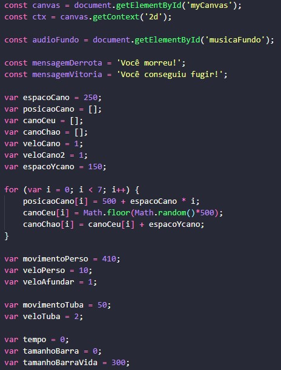

No começo temos todas as const e variáveis que serão utilizadas no código.

Primeiro foi pego a id do canvas e uma const "ctx" para mostrar o que vai ser renderizado.

Depois pegamos o id do audio que adicionamos no html e atribuimos em uma const chamada "audioFundo".

Após o áudio temos as mensagens que aparecerão no fim do jogo, uma é a de vitória e outra a de derrota.

A variável espacoCano é o espaçamento dos canos no eixoX, e a variável espacoYcano é o espaçamento dos canos no eixoY.

Temos também os valores da velocidade do cano(veloCano e veloCano2).

As variáveis posicaoCano, canoCeu e canoChao estão como [] pois são um array vazio, que logo em seguida terá uma estrutura de repetição for com a variável i sendo igual a 0 e menor que 7(refere-se ao número de canos, que é 6) onde irá atribuir valores a esses array. Esse código foi utilizado para que não precisasse criar uma variavel para cada cano, assim deixando o código mais limpo e simples.

A posicaoCano é igual ao seu ponto incial(500) mais o espaçamento do cano no eixo X multiplicado pelo número do cano(quanto maior, maior a distância do ponto inicial), essa variável foi colocada no lugar da posição "X" do retângulo no obstáculo.

O canoCeu é um valor aleatório de 0 a 500, essa variável foi colocada no lugar da "altura" do retângulo no obstáculo. Já o canoChao é esse valor aleatório + o espaçamento do cano no eixo Y, essa variável foi colocada na posição "Y" do retângulo no obstáculo.

As variaveis "movimentoPerso", "veloPerso", "veloAfundar", "movimentoTuba" e "veloTuba" são de movimento do personagem e do tubarão. A variável movimentoPerso foi colocada no lugar da posição "Y" do retângulo no personagem e no tubarão. A variável movimentoTuba foi colocada no lugar da posição "X" do retângulo no tubarão. As variáveis de velocidade são apenas para adicionar nas variáveis de movimento.

Por fim as variaveis de tempo, tamanho da barra de percuso e o tamanho da barra de vida.

### Contadores
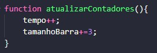

A function contadores é responsável por aumentar +1 no tempo e +3 no tamanho da barra do percurso a cada segundo. Mas para que isso sejá possível, foi preciso colocar o código "intervalo = setInterval(atualizarContadores, 1000)" na hora de iniciar o jogo.
 

### Inicio function animar
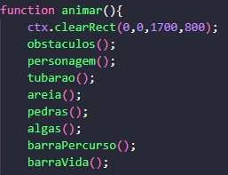

Nessa parte inicial da function animar, chamamos todas as funções criadas no script "functions" para que tudo que foi criado não seja apagado devido ao clearRect, que faz com que as animações do personagem, tubarão e dos canos não fique duplicando eles.

### Afundar personagem
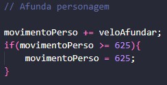

Esse código fará com que o personagem fique sempre indo para baixo/afundando. O if é para que se o personagem afundar totalmente, ele fique parado.

### Mover obstáculos
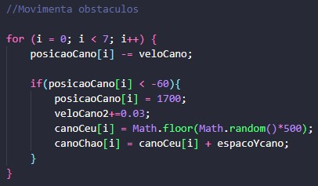

Esse código faz com que todos os 6 obstáculos se movam no eixoX negativo(para a esquerda), assim dando a impressão de que o personagem e o tubarão estão se movendo. O if é para que se determinado obstáculo sair totalmente da tela, ele irá aparecer do outro lado da tela, assim aumentando +0.03 da velocidade de todos os canos e atribuindo um novo valor aleatória na posição do canoCeu e do canoChao que saiu totalmente da tela.

### Aumentar velocidade do personagem
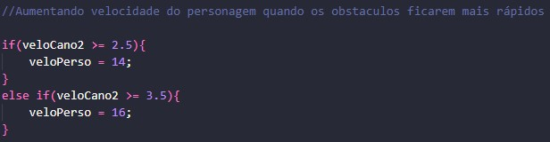

Para o jogo não se tornar impossível, contendo canos que o personagem não consiga desviar, esse código fará com que a velocidade do personagem aumente quando a velocidade do cano chegar em tal valor.

### Colisão
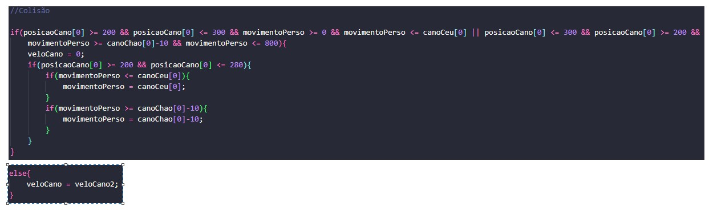

Para fazer a colisão do personagem com o obstáculo, foi preciso utilizar uma lógica com if e else. A lógica foi que se a posição X do cano for igual a posição X do personagem, e o movimentoPerso que é a posição Y do personagem for maior ou igual a 0 e menor ou igual ao tamanho do canoCeu (tamanho total do cano de cima) ou se a posição X do cano for igual a posição X do personagem, e o movimentoPerso for menor ou igual a 800 e maior ou igual a posição do canoChao (tamanho total do cano de baixo), a velocidade do cano será zero, assim dando a impressão de que o personagem parou. dentro desse if possui outro if, que é para o personagem não colidir apenas batendo de frente com o obstáculo, mas também batendo de baixo e de cima, assim não atravessando ele. Esse código de colisão é de apenas um obstáculo, essa lógica foi utilizada nos 6.

Por fim possui um else para que se não colidiu, o cano continue movimentando.

### Movimento tubarão
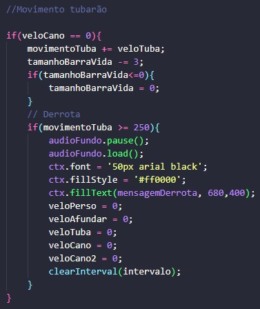

O movimento do tubarão no eixo X só acontece quando a velocidade do cano for 0, se for, o tubarão irá se mover no eixo X se aproximando cada vez mais da posição X do personagem e a barra de vida diminui. Enquanto o personagem tiver na área de colisão do obstáculo, a velocidade vai continuar sendo zero. OBS: A posição do tubarão no eixo Y é a mesma do personagem, para dar a impressão de que ele está perseguindo o personagem.

Temos também a parte da derrota, se o tubarão alcançar o personagem (As posições X dos dois ser igual), a música de fundo irá parar, o tempo e a barra de percurso também vão parar, a barra de vida ficará vazia, as velocidades serão 0 e aparecerá a mensagem de derrota na tela, com a cor vermelha e a fonte arial black com 50px.

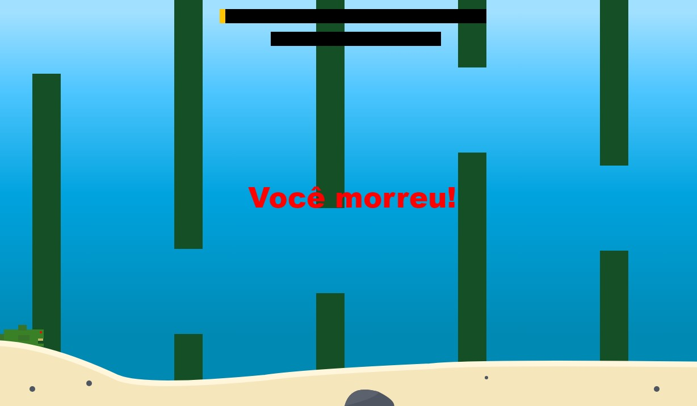

### Parte final da function animar
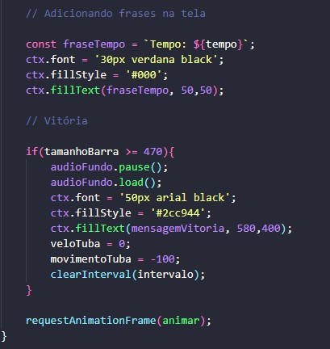

No final da função animar, temos o código para colocar o tempo na tela.

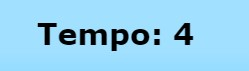

Temos também o código que irá mostrar a vitória. Se a barra do percurso chegar ao fim, o áudio irá parar, o tubarão irá sumir, o tempo irá parar e irá aparecer a mensagem de vitória na tela.

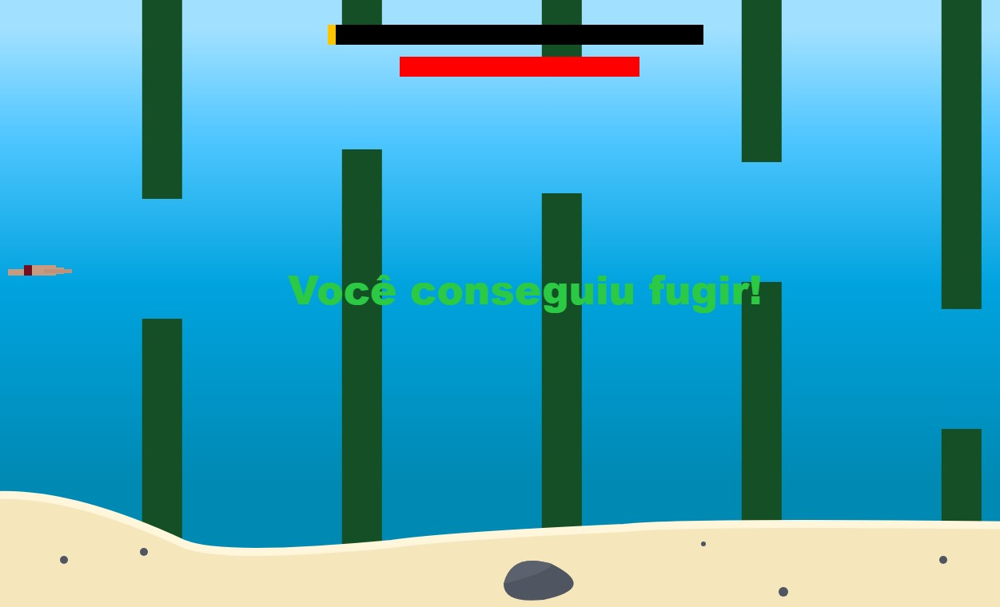

Por fim colocamos um "requestAnimationFrame(animar)" que é o responsável por animar tudo no nosso jogo.

### Function reiniciar
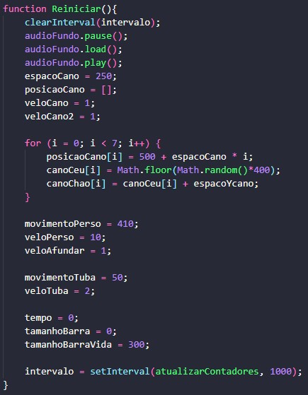

A function reiniciar irá retornar todas as variáveis aos seus valores iniciais após clicar no botão reiniciar.

### Function iniciar
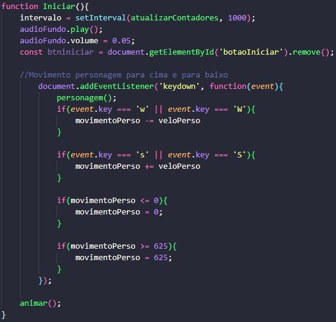

Ao clicar no botão de iniciar, a function animar() será chamada, assim começando o jogo. Além da function animar(), também temos que os movimento do personagem a partir das teclas W para cima e S para baixo irão começar a funcionar, o botão iniciar será removido, a música de fundo irá começar a tocar e o tempo e a barra de percurso irão começar a aumentar.

### Chamando funções
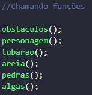

Por fim, chamamos todas as funções dos elementos que queremos que apareça antes de iniciar o jogo.

## Vídeos mostrando o jogo
### Mostrando derrota
https://github.com/CauaSilva28/jogo-tubarao-canvas/assets/127631052/1366abec-5b82-4d70-b94b-7069e891fcfe

### Mostrando vitória
https://github.com/CauaSilva28/jogo-tubarao-canvas/assets/127631052/56c52743-d8b8-459a-8e14-942bb2d8de8e

